## Objective 

#### Here we need to analyse and predict the house value situated in US, by using the data provided. We need to check whether several factors like total number of rooms, or households have any significant corelation with median house prices and after exploratory analysis we need to suggest and apply optimum model for the data for further predictions of the median house prices.

## Data 
The data can be downloaded from
[here](https://github.com/ageron/handson-ml2/raw/master/datasets/housing/housing.csv)

## Basic Exploratory Analysis :

### Data Schematic and Summary :


```r
library(dplyr)
library(ggplot2)
library(reshape2)
library(gridExtra)
library(caret)
library(Hmisc)
library(MASS)
library(randomForest)
housing_data <- read.csv("https://github.com/ageron/handson-ml2/raw/master/datasets/housing/housing.csv")
```


```
##   longitude latitude housing_median_age total_rooms total_bedrooms population
## 1   -122.23    37.88                 41         880            129        322
## 2   -122.22    37.86                 21        7099           1106       2401
## 3   -122.24    37.85                 52        1467            190        496
## 4   -122.25    37.85                 52        1274            235        558
## 5   -122.25    37.85                 52        1627            280        565
## 6   -122.25    37.85                 52         919            213        413
##   households median_income median_house_value ocean_proximity
## 1        126        8.3252             452600        NEAR BAY
## 2       1138        8.3014             358500        NEAR BAY
## 3        177        7.2574             352100        NEAR BAY
## 4        219        5.6431             341300        NEAR BAY
## 5        259        3.8462             342200        NEAR BAY
## 6        193        4.0368             269700        NEAR BAY
```

```
##    longitude         latitude     housing_median_age  total_rooms   
##  Min.   :-124.3   Min.   :32.54   Min.   : 1.00      Min.   :    2  
##  1st Qu.:-121.8   1st Qu.:33.93   1st Qu.:18.00      1st Qu.: 1448  
##  Median :-118.5   Median :34.26   Median :29.00      Median : 2127  
##  Mean   :-119.6   Mean   :35.63   Mean   :28.64      Mean   : 2636  
##  3rd Qu.:-118.0   3rd Qu.:37.71   3rd Qu.:37.00      3rd Qu.: 3148  
##  Max.   :-114.3   Max.   :41.95   Max.   :52.00      Max.   :39320  
##                                                                     
##  total_bedrooms     population      households     median_income    
##  Min.   :   1.0   Min.   :    3   Min.   :   1.0   Min.   : 0.4999  
##  1st Qu.: 296.0   1st Qu.:  787   1st Qu.: 280.0   1st Qu.: 2.5634  
##  Median : 435.0   Median : 1166   Median : 409.0   Median : 3.5348  
##  Mean   : 537.9   Mean   : 1425   Mean   : 499.5   Mean   : 3.8707  
##  3rd Qu.: 647.0   3rd Qu.: 1725   3rd Qu.: 605.0   3rd Qu.: 4.7432  
##  Max.   :6445.0   Max.   :35682   Max.   :6082.0   Max.   :15.0001  
##  NA's   :207                                                        
##  median_house_value ocean_proximity   
##  Min.   : 14999     Length:20640      
##  1st Qu.:119600     Class :character  
##  Median :179700     Mode  :character  
##  Mean   :206856                       
##  3rd Qu.:264725                       
##  Max.   :500001                       
## 
```


By looking at the summary we can see that ocean proximity is a factor variable but isn't in the right format, so we will convert is as factor and then unclass it to make use of it in our model.
factors coded as :
1. OCEAN
2. INLAND
3. ISLAND
4. NEAR BAY
5. NEAR ocean

By this plot we can see some correlation among the median income and house value variables this will a lot more clearer after a correlation test.

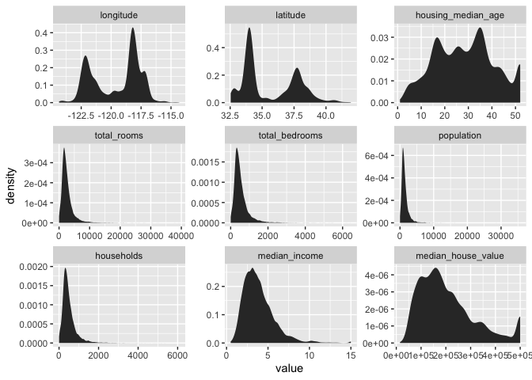<!-- -->

#### Correlation Test :


```
## [1] "Correlation of Median House Value and Median Income"
```

```
## $estimate
##       cor 
## 0.6880752
```

```
## [1] "Correlation of Median House Value and Longitude"
```

```
## $estimate
##         cor 
## -0.04596662
```

```
## [1] "Correlation of Median House Value and Latitude"
```

```
## $estimate
##        cor 
## -0.1441603
```

```
## [1] "Correlation of Median House Value and Median Age"
```

```
## $estimate
##       cor 
## 0.1056234
```

```
## [1] "Correlation of Median House Value and Total Rooms"
```

```
## $estimate
##       cor 
## 0.1341531
```

```
## [1] "Correlation of Median House Value and Total BedRooms"
```

```
## $estimate
##        cor 
## 0.04968618
```

```
## [1] "Correlation of Median House Value and Population"
```

```
## $estimate
##         cor 
## -0.02464968
```

```
## [1] "Correlation of Median House Value and House Holds"
```

```
## $estimate
##        cor 
## 0.06584265
```
Median Income, Median Age and Total Rooms have some higher correlation and will be of benefit to add in our model. Others also add to some information but have a relatively low values of correlation ie; cor(x,y) is close to 0 rather than close to 1 or -1.

By looking at the data I thought transforming some variables would a good option rather than using them directly, by this we can keep the information the data wants us to provide in the manner we want ie; helping the machine learning algorithm to give better results.

So the most sensible thing to do is divide the number_of_bedrooms column with total_number_of_rooms.

Other Transformations can be made but won't make much of a difference.


```
## [1] "Correlation of bedrooms/total_rooms and Median House Value"
```

```
## $estimate
##        cor 
## -0.2558801
```

We improved, as expected!

### Exploratory Plots :

We seen results of correlations test but to get a clear and visual picture of our data we will still plot some scatter plots as well as using LAT and LONG we will plot a density scatter plot to check in which portion of the map does the median prices go up.

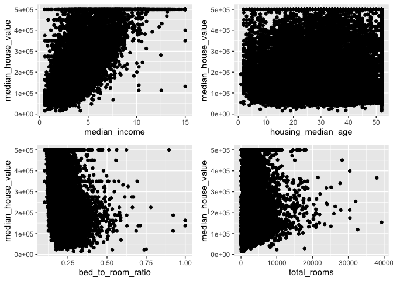<!-- -->

We can see the variations and as well as difference in the total_rooms and bed_to_room_ratio.

Now with the help of the Lattitudes and Longitudes provided in the data we can plot a map like figure and see where are the median_house_values greater using alpha 

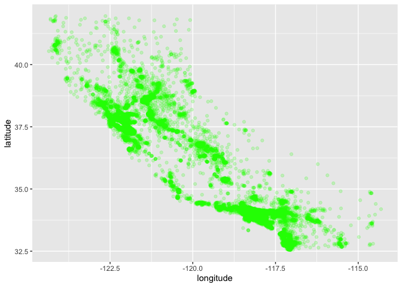<!-- -->

Denser the Green Color more are the values concentrated, and by this figure we can say that the houses near bay have high median values relative to others categories.

But to strongly proove our point we will plot a boxplot.
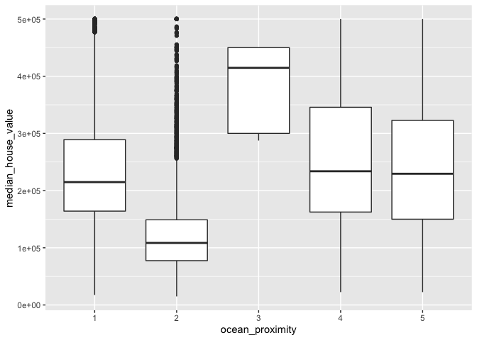<!-- -->
We can clearly see that in general Houses with ISLAND as ocean proximity have the highest median values compared to others, while the second highest values are of NEAR BAY, NEAR OCEAN and OCEAN proximities, these values are close and median values which are the lowest falls in the INLAND proximities with lot of outliers, which supports the theory that inland houses vary a lot in prices and other factor govern them.

## MODEL BUILDING :

Before Building and selecting model I will subset the variables of interest and will only work on that.

And Using the caret package we will split the dataset into train and test set and will also use caret for model building.


```
##   latitude longitude median_income housing_median_age bed_to_room_ratio
## 1    37.88   -122.23        8.3252                 41         0.1465909
## 2    37.86   -122.22        8.3014                 21         0.1557966
## 3    37.85   -122.24        7.2574                 52         0.1295160
## 4    37.85   -122.25        5.6431                 52         0.1844584
## 5    37.85   -122.25        3.8462                 52         0.1720959
## 6    37.85   -122.25        4.0368                 52         0.2317737
##   ocean_proximity median_house_value
## 1               4             452600
## 2               4             358500
## 3               4             352100
## 4               4             341300
## 5               4             342200
## 6               4             269700
```

After subsetting the data next thing we have to deal with is missing values, here I will omit the na values during model training and while testing i will clean the test set by removing the na instances.


```r
index <- createDataPartition(subset_data$median_house_value, p = 0.8, list = FALSE)
train <- subset_data[index,]
test <- subset_data[-index,]
dim(train)
```

```
## [1] 16513     7
```

```r
dim(test)
```

```
## [1] 4127    7
```

Now that we have a train and test set we will clean both of them separately, we can impute the missing values or we can just omit them.


```r
test <- na.omit(test)
dim(test)
```

```
## [1] 4095    7
```

### MODEL 1 Basic Linear Model (Linear Regression) :


```r
lm_model_1 <- lm(median_house_value ~ . , data = train, na.action = na.omit)

summary(lm_model_1)
```

```
## 
## Call:
## lm(formula = median_house_value ~ ., data = train, na.action = na.omit)
## 
## Residuals:
##     Min      1Q  Median      3Q     Max 
## -583189  -44145  -11590   29585  470139 
## 
## Coefficients:
##                      Estimate Std. Error t value Pr(>|t|)    
## (Intercept)        -2.063e+06  1.008e+05 -20.452  < 2e-16 ***
## latitude           -2.123e+04  1.154e+03 -18.395  < 2e-16 ***
## longitude          -2.329e+04  1.169e+03 -19.923  < 2e-16 ***
## median_income       4.333e+04  4.119e+02 105.211  < 2e-16 ***
## housing_median_age  8.630e+02  4.745e+01  18.186  < 2e-16 ***
## bed_to_room_ratio   2.786e+05  1.280e+04  21.767  < 2e-16 ***
## ocean_proximity2   -3.810e+04  2.034e+03 -18.727  < 2e-16 ***
## ocean_proximity3    1.391e+05  3.554e+04   3.914 9.12e-05 ***
## ocean_proximity4    5.771e+03  2.201e+03   2.622  0.00874 ** 
## ocean_proximity5    1.008e+04  1.805e+03   5.586 2.36e-08 ***
## ---
## Signif. codes:  0 '***' 0.001 '**' 0.01 '*' 0.05 '.' 0.1 ' ' 1
## 
## Residual standard error: 71010 on 16328 degrees of freedom
##   (175 observations deleted due to missingness)
## Multiple R-squared:  0.6211,	Adjusted R-squared:  0.6209 
## F-statistic:  2974 on 9 and 16328 DF,  p-value: < 2.2e-16
```

```r
model_1_predict <- predict(newdata = test, lm_model_1)

test_set_error_1 <- mean((model_1_predict - test$median_house_value)^2)

test_set_error_1 <- sqrt(test_set_error_1)

test_set_error_1
```

```
## [1] 72274.59
```

By applying LM model we get train set error of 70,810/- while a test set error of 73,131/- 

The model did not perform too well and it is clearly a high bias problem.

Residual Plot of Model 1

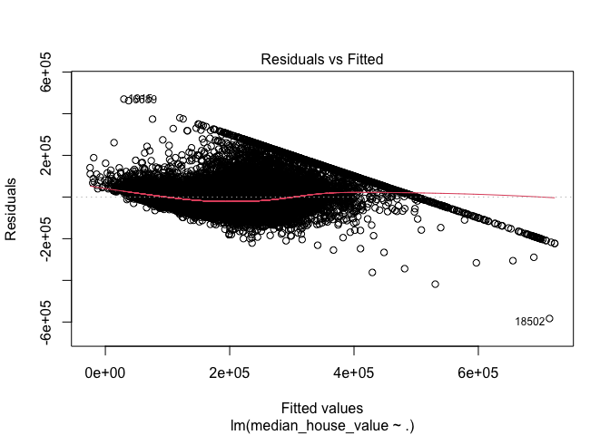<!-- -->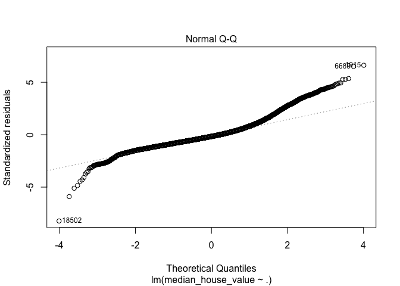<!-- -->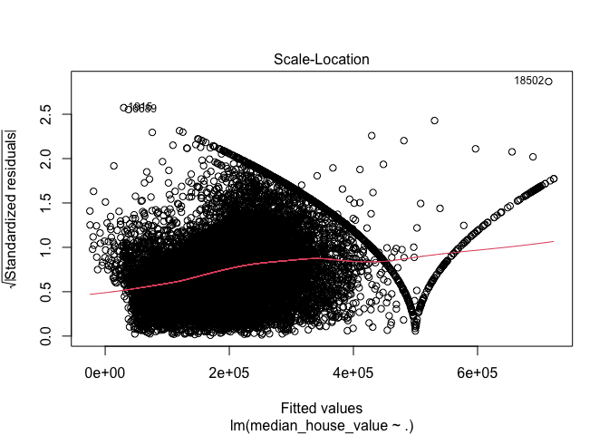<!-- -->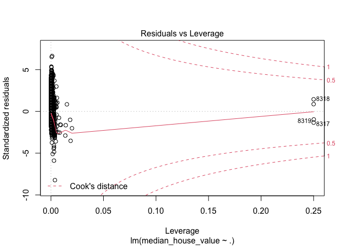<!-- -->

By looking at the plots we can infer that the model is not wrong but the relation ship between the data is not fully determined by the variables, the residual are scattered but too much overlaped.

### MODEL 2 Linera Model with quadratic weighted output :

Okay so using the boxcox function from the MASS package we can get an optimum quadratic weight for our data and then we can perform a linear model to see if it has any significant effect.


```r
bc <- boxcox(lm_model_1)
```

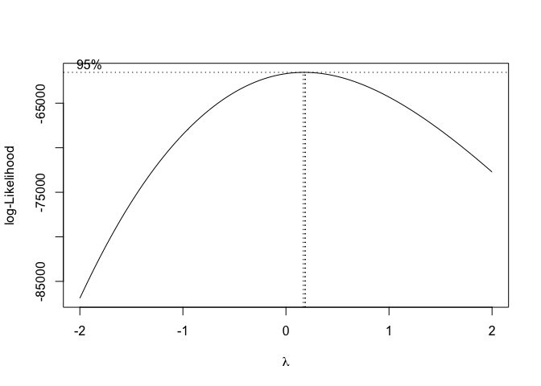<!-- -->

```r
lambda <- bc$x[which.max(bc$y)]
lambda
```

```
## [1] 0.1818182
```

Now lets fit a new linear model after applying the transformation to the output.


```r
z <- (train$median_house_value)^lambda

lm_model_2 <- lm(z ~ . , data = train, na.action = na.omit)

summary(lm_model_2)
```

```
## 
## Call:
## lm(formula = z ~ ., data = train, na.action = na.omit)
## 
## Residuals:
##      Min       1Q   Median       3Q      Max 
## -1.77903 -0.09918  0.05614  0.12936  0.62666 
## 
## Coefficients:
##                      Estimate Std. Error t value Pr(>|t|)    
## (Intercept)         2.449e+00  3.051e-01   8.028 1.05e-15 ***
## latitude           -6.597e-02  3.484e-03 -18.935  < 2e-16 ***
## longitude          -6.475e-02  3.534e-03 -18.324  < 2e-16 ***
## median_income      -2.906e-03  1.594e-03  -1.823 0.068276 .  
## housing_median_age -3.229e-03  1.432e-04 -22.549  < 2e-16 ***
## bed_to_room_ratio  -4.827e-01  3.879e-02 -12.444  < 2e-16 ***
## ocean_proximity2   -2.030e-01  6.142e-03 -33.060  < 2e-16 ***
## ocean_proximity3   -1.727e-02  1.062e-01  -0.163 0.870840    
## ocean_proximity4   -2.224e-02  6.576e-03  -3.382 0.000721 ***
## ocean_proximity5   -6.717e-02  5.396e-03 -12.449  < 2e-16 ***
## median_house_value  7.202e-06  2.338e-08 308.077  < 2e-16 ***
## ---
## Signif. codes:  0 '***' 0.001 '**' 0.01 '*' 0.05 '.' 0.1 ' ' 1
## 
## Residual standard error: 0.2121 on 16327 degrees of freedom
##   (175 observations deleted due to missingness)
## Multiple R-squared:  0.9479,	Adjusted R-squared:  0.9479 
## F-statistic: 2.971e+04 on 10 and 16327 DF,  p-value: < 2.2e-16
```

```r
model_2_predict <- predict(newdata = test, lm_model_2)

test_set_error_2 <- mean((((model_2_predict)^(1/lambda)) - test$median_house_value)^2)

test_set_error_2 <- sqrt(test_set_error_2)

test_set_error_2
```

```
## [1] 30359.4
```

Good improvement relative to model 1 as the RMSE was around 0.2126 (which is for transformed data) and the RSquared that is how much variance or how much the output variable is explained by the given features is also raised to 94.75% which is around 33% greater than model 1. And the RMSE on the test set is around 30,000 which is 40,000 less than model 1. 

Residual Plot for model 2 :
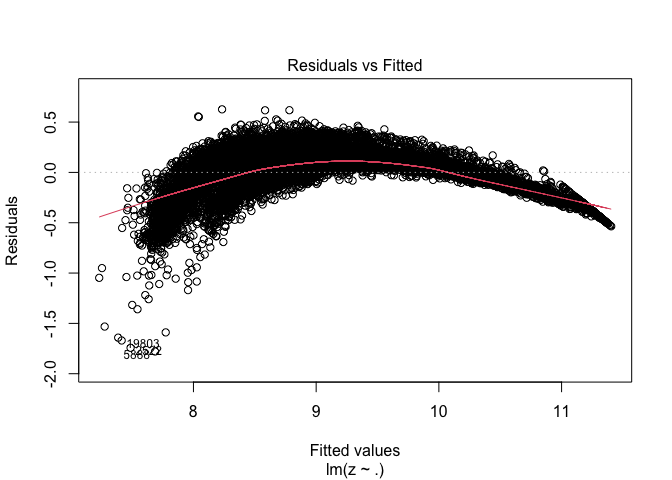<!-- -->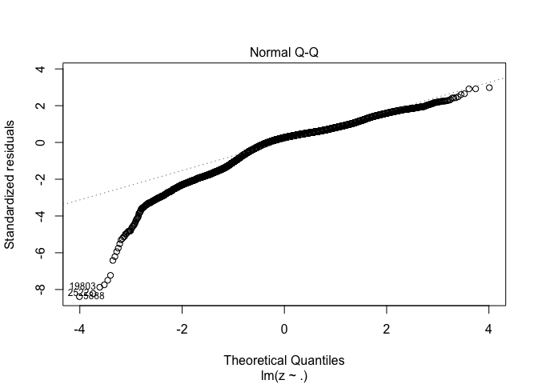<!-- -->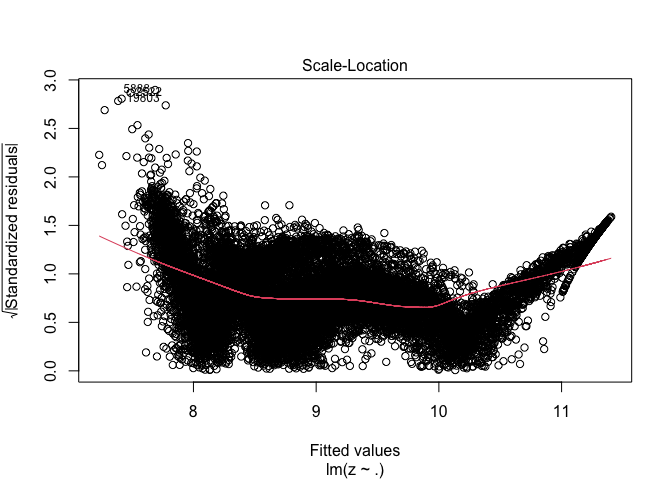<!-- -->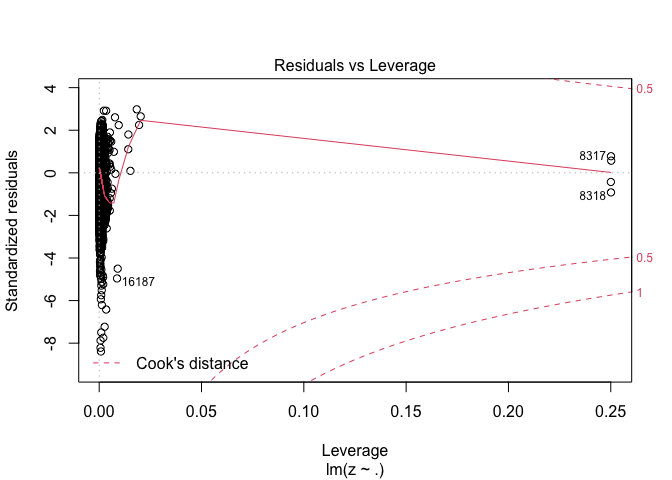<!-- -->

### MODEL 3 Regression Forest : 

Trying regression forest is also a good option, as it is one of most widely used algorithm in machine learning community and often performs well in many scenarios, testing it would be a good option.


```r
rf_model_3 <- train(median_house_value ~ . , method = "rf", data = train, na.action = na.omit, ntree = 35) 
```


```r
rf_model_3
```

```
## Random Forest 
## 
## 16513 samples
##     6 predictor
## 
## No pre-processing
## Resampling: Bootstrapped (25 reps) 
## Summary of sample sizes: 16338, 16338, 16338, 16338, 16338, 16338, ... 
## Resampling results across tuning parameters:
## 
##   mtry  RMSE      Rsquared   MAE     
##   2     56892.26  0.7693602  40385.05
##   5     50293.02  0.8091987  33115.54
##   9     51623.75  0.7988219  33715.03
## 
## RMSE was used to select the optimal model using the smallest value.
## The final value used for the model was mtry = 5.
```

```r
model_3_predict <- predict(newdata = test, rf_model_3)

test_set_error_3 <- mean((model_3_predict - test$median_house_value)^2)

test_set_error_3 <- sqrt(test_set_error_3)

test_set_error_3
```

```
## [1] 48976.58
```

As we can infer that the rf model worked better than simple LM but it was less efficient than the transformed LM model.

## Final Conclusion :

By performing the above analysis I can say that the housing data has a weak relation with the provided variables, but there are some relations as we observed them during exploratory analysis. RF model would have worked better with grid search method and trying other hyper paramters, like different number of trees and mtry values.

As we observed that model 2 performed better than both of the other proposed models, and thus we can prefer model 2 with lambda = 0.181 (approx).

This is a normal test report and there are many other ways and many other models which can be used for better prediction.

## Ways to improve :

- Grid Search Method can be used to test different hyper parameters for Regression Forest (but it wont have highly significant effect)

- GBM or XGBoost can be used for better perfomance of weak models, XGboost works exceptionally best in competitions and often used for best accuracy, but it is computer intensive and takes a while to train. 
 And the factor which stopped me to use XGBOOST in this particular problem was, the sensitivity of the algorithm against outliers.
 XGboost is sensitive to outliers and thus can lead to extreme overfitting, and while exploratory analysis we found that the data is widely spread as median house value depends on many factors practically and thus provided with more data and more practically collected data we can give a better prediction and better analysis of the data.
